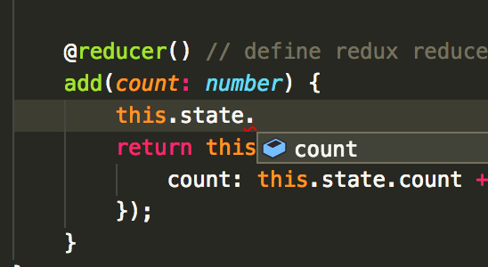
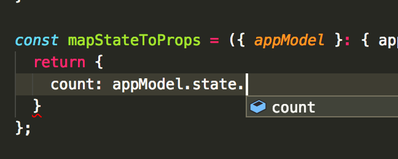

# 智能提示与类型检查

## 类型检查
### 在模型中获得类型检查
首先定义模型的state类型
```
interface AppState {
    count: number;
}
```

init注解支持泛型传入模型的state类型，这样初始化的state会获得类型检查。
```
@init<AppState>({
    name: 'appModel',
    state: {
        count: 0 // 获得类型检查
    }
})
```

基类Model支持泛型传入模型的state类型，在模型中所有对state的操作都能获得类型检查。
```
export default class AppModel extends Model<AppState> {
}
```

effect中内置reducer：this.fulfilled获得类型检查
```
@effect()
* addAsync(count: number) {
    return this.fulfilled({
        count: this.state.count + count // 获得类型检查
    });
}
```

reducer中的帮助函数this.fulfilled获得类型检查
```
@reducer()
add(count: number) {
    return this.fulfilled({
        count: this.state.count + count, // 获得类型检查
    });
}
```

### 调用Action创建函数获得类型检测
```
// 获得模型，也可以在组件中通过connect注入获得模型
const appModel = resa.models.appModel;
appModel.addAsync(1); // 函数参数获得类型检查
```

### connect函数返回的组件获得JSX的参数检查
react-redux的connect函数返回的组件本身支持JSX参数检查（去除connect带给组件的参数），但是由于resa的connect函数支持传入字符串数组，因此破坏了react-redux定义的connect函数类型。

为了获取JSX参数检查的效果，resa支持传递给connect一个泛型类型，该泛型类型直接反映了connect函数会给组件注入哪些参数，connect函数返回的组件去除了这些参数，以此实现JSX的参数检查。

下面展示使用connect时组件定义的方式。

首先定义注入的Props。
```
interface InjectedProps {
  count: number;
  appModel: AppModel;
}
```

再定义组件的Props，继承注入的Props。
```
interface AppProps extends InjectedProps {
    length: number;
}
```

再定义组件。
```
class App extends React.Component<AppProps> {
  render() {
    return (
      <div className="App">
        xxx
      </div>
    );
  }
}
```

最后连接组件。
```
const mapStateToProps = ({ appModel }: { appModel: AppModel }) => {
  return {
    count: appModel.state.count
  };
};

const NewApp = connect<InjectedProps>(mapStateToProps, ['appModel'])(App);
```

使用NewApp组件时会获得JSX类型检查。

## 智能提示
在模型函数中获得state的智能提示。



在模型中调用其他reducer或effect时获得智能提示

*注意：在reducer函数中虽然可以提示effect函数，但是实际上不能调用。*


mapStateToProps中通过手动类型标注获得智能提示



在组件中调用Action创建函数获得智能提示


